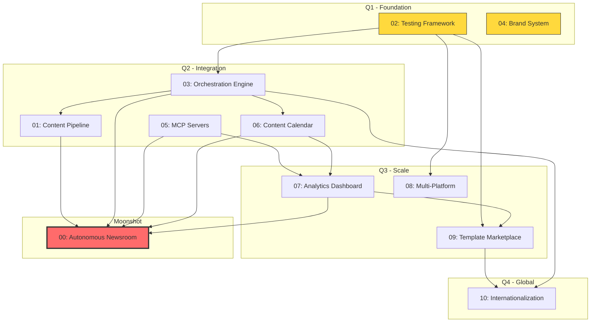

# 2026 Strategic Roadmap: BNS Marketplace

## Executive Summary

The bns-marketplace has evolved from a single development workflow plugin into a comprehensive content operations platform. With 7 plugins spanning development (bns-dev), editorial (tdd-editor), design (tdd-design), technical content (tdd-tech), growth (tdd-growth), revenue (tdd-revenue), and community (tdd-community), the marketplace now contains a complete "virtual newsroom" capable of running an entire publication.

**But this potential is unrealized.** Today, these plugins operate in isolation. Users must manually invoke each one, copy outputs between them, and coordinate workflows themselves. The marketplace is a collection of tools, not a system.

This roadmap transforms bns-marketplace from a toolkit into an **autonomous content operation platform**. By the end of 2026, a user will be able to describe a content idea and watch as AI agents research, write, edit, design, optimize, and distribute—all orchestrated automatically.

### The Vision

```
Today: User → Plugin → Output → User → Plugin → Output → User → ...
       (manual coordination at every step)

2026:  User → Pipeline → Agents collaborate → Complete deliverable
       (human reviews and approves, AI handles execution)
```

### High-Level Themes

1. **Integration** (Q1-Q2): Connect the isolated plugins into a unified system
2. **Quality** (Q1-Q2): Add testing, complete the brand system, eliminate technical debt
3. **Intelligence** (Q2-Q3): Enable real integrations via MCP, track what works
4. **Scale** (Q3-Q4): Expand platforms, open to community, go global

## Initiative Overview

| # | Initiative | Category | Quarter | Size | Status |
|---|------------|----------|---------|------|--------|
| **00** | [**The Autonomous Newsroom**](00-moonshot.md) | Moonshot | Q1-Q4 | XXL | Planned |
| 01 | [Multi-Agent Content Pipeline](01-multi-agent-content-pipeline.md) | Architecture | Q1-Q2 | XL | Planned |
| 02 | [Plugin Testing Framework](02-plugin-testing-framework.md) | Testing | Q1 | L | Planned |
| 03 | [Cross-Plugin Orchestration Engine](03-cross-plugin-orchestration-engine.md) | Architecture | Q2 | XL | Planned |
| 04 | [Visual Brand System Completion](04-visual-brand-system-completion.md) | Technical Debt | Q1 | M | Planned |
| 05 | [MCP Server Integration](05-mcp-server-integration.md) | Integration | Q2 | L | Planned |
| 06 | [Content Calendar & Editorial Workflow](06-content-calendar-editorial-workflow.md) | New Feature | Q2 | L | Planned |
| 07 | [Plugin Analytics & Metrics Dashboard](07-plugin-analytics-metrics-dashboard.md) | DX Improvement | Q3 | M | Planned |
| 08 | [Multi-Platform Distribution](08-multi-platform-distribution.md) | Scalability | Q3 | L | Planned |
| 09 | [Template Marketplace](09-template-marketplace.md) | New Feature | Q3 | M | Planned |
| 10 | [Internationalization Framework](10-internationalization-framework.md) | Scalability | Q4 | M | Planned |

## Dependency Graph



## Quarterly Roadmap

### Q1 2026: Foundation

**Focus:** Eliminate technical debt, establish quality foundations

| Initiative | Effort | Impact |
|------------|--------|--------|
| 02: Plugin Testing Framework | L | Critical - enables safe iteration |
| 04: Visual Brand System Completion | M | High - unblocks design plugin |

**Key Outcomes:**
- All plugins have automated validation
- Brand system complete with real colors and assets
- CI/CD pipeline running on every commit
- Confident foundation for building on

### Q2 2026: Integration

**Focus:** Connect the isolated plugins into a unified system

| Initiative | Effort | Impact |
|------------|--------|--------|
| 03: Cross-Plugin Orchestration Engine | XL | Transformative |
| 01: Multi-Agent Content Pipeline | XL | Transformative |
| 05: MCP Server Integration | L | High |
| 06: Content Calendar | L | High |

**Key Outcomes:**
- Plugins can invoke each other
- First end-to-end content pipelines working
- Real integrations with social platforms
- Editorial workflow for planning content

### Q3 2026: Scale

**Focus:** Measure, expand, open up

| Initiative | Effort | Impact |
|------------|--------|--------|
| 07: Plugin Analytics & Metrics | M | High |
| 08: Multi-Platform Distribution | L | High |
| 09: Template Marketplace | M | High |

**Key Outcomes:**
- Know which plugins and commands provide value
- Plugins work in VSCode and other environments
- Community can contribute plugins and skills
- Quality discovery and ratings

### Q4 2026: Global

**Focus:** Internationalization and community growth

| Initiative | Effort | Impact |
|------------|--------|--------|
| 10: Internationalization Framework | M | High |

**Key Outcomes:**
- Plugins work in multiple languages
- Spanish and English as first-class citizens
- Community translations infrastructure
- True global reach

## Resource Estimates

| Size | Engineering Weeks | Typical Scope |
|------|-------------------|---------------|
| S | 1-2 | Bug fix, small feature |
| M | 3-4 | New command, skill, or integration |
| L | 6-8 | Major feature, new system |
| XL | 10-16 | Cross-cutting architecture |
| XXL | 20+ | Platform-level transformation |

**Total 2026 Investment:** ~70-90 engineering weeks

## Success Metrics

By end of 2026, we should see:

| Metric | Current | Target |
|--------|---------|--------|
| Plugins | 7 | 15+ (with community) |
| Test Coverage | 0% | 80%+ |
| Platforms | 1 | 3+ |
| Languages | 2 (mixed) | 3+ (structured) |
| Monthly Active Users | ? | 1,000+ |
| Community Contributors | 1 | 20+ |
| Content Pipelines | 0 | 5+ templates |

## How to Read This Roadmap

Each initiative file follows a consistent format:

- **Category**: What type of work (Architecture, Testing, New Feature, etc.)
- **Quarter**: When we aim to complete it
- **T-shirt Size**: Relative effort estimate
- **Why This Matters**: Strategic importance
- **Current State**: Where we are today
- **Proposed Future State**: Vision for completion
- **Key Deliverables**: Specific outputs (checkboxes)
- **Prerequisites**: What must come first
- **Risks & Open Questions**: Known unknowns
- **Notes**: References to code, related work

## Contributing

This roadmap is a living document. To propose changes:

1. Open an issue describing the change
2. Discuss with maintainers
3. Submit a PR updating the relevant initiative file
4. For new initiatives, follow the template format

## Next Steps

1. Review and prioritize initiatives
2. Assign owners to Q1 work
3. Create GitHub issues for deliverables
4. Begin with #02 (Testing Framework) and #04 (Brand System)
5. Establish weekly roadmap review cadence

---

*Last updated: December 2025*
*Next review: January 2026*
