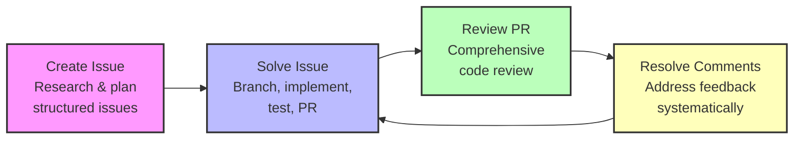

# BNS Marketplace

The brasas & nube marketplace for Claude Code plugins. Currently featuring the bns-dev plugin for GitHub-based development workflows.

## Quick Start

### Standard Installation
Run Claude and add the marketplace:

```bash
/plugin marketplace add https://github.com/chekos/bns-marketplace
```

Then install the plugin:

```bash
/plugin install bns-dev
```

### One-Command Installation
Use the [Claude Plugins CLI](https://claude-plugins.dev) to skip the marketplace setup:

```bash
npx claude-plugins install @chekos/bns-marketplace/bns-dev
```

This automatically adds the marketplace and installs the plugin in a single step.

### Factory (Droid) quick start

1) Install Droid (Factory).

```bash
bunx droid-factory
```

What this does: copies Claude Code marketplace commands/agents/subagents and converts them to Droid format.

Next:
- Start Droid
- In Settings, enable Sub-agents

You're done: use this source from Droid. You don't need to add it in Claude Code anymore.

---

# BNS Dev Plugin

An opinionated Claude Code plugin for GitHub-based development workflows. Transform how you plan, execute, and review work using AI-powered tools that follow the research → plan → implement → verify pattern.

## What Is BNS Dev?

**Systematic development workflows that leverage GitHub CLI and AI-powered planning.**

Modern development requires juggling multiple contexts: understanding issues, planning implementations, reviewing code, and resolving feedback. This plugin provides structured workflows that make each of these tasks more systematic and thorough.

The bns-dev plugin provides four core commands that cover the complete development lifecycle:
- **Plan**: Transform ideas into well-structured GitHub issues
- **Execute**: Tackle GitHub issues from analysis to pull request
- **Review**: Perform comprehensive pull request reviews
- **Resolve**: Systematically address all PR review comments



## How It Works

The plugin follows a systematic four-phase workflow:

### 1. Create: Turn Ideas Into Structured Issues

Use `/create-issue` to transform feature descriptions into comprehensive GitHub issues.

**What it does:**
- Researches your repository structure and conventions
- Reviews CONTRIBUTING.md and issue templates
- Searches for best practices and examples
- Creates detailed issues with proper labels

**The result:** Well-structured issues that provide clear guidance for implementation.

### 2. Solve: Execute Issues End-to-End

Use `/solve-issue` to tackle GitHub issues from initial analysis through pull request creation.

**What it does:**
- Views and analyzes the GitHub issue
- Examines relevant parts of the codebase
- Creates a feature branch: `feature/[issue-number]-brief-description`
- Generates comprehensive implementation plan with TodoWrite
- Asks for approval before implementing
- Considers testing, documentation, performance, and security

**The result:** Issues resolved systematically with full context and planning.

### 3. Review: Comprehensive Pull Request Analysis

Use `/review-pr` to perform thorough pull request reviews.

**What it does:**
- Analyzes code quality and best practices
- Identifies potential bugs or issues
- Reviews performance considerations
- Checks for security concerns
- Evaluates test coverage

**The result:** Actionable feedback that improves code quality before merging.

### 4. Resolve: Systematic Comment Resolution

Use `/resolve-pr-comments` to systematically address all PR review feedback.

**What it does:**
- Extracts all unresolved review comments via GitHub API
- Creates detailed resolution plan with TodoWrite
- Makes requested code changes
- Runs tests and linting
- Supports parallel sub-agents for independent comments
- Commits changes with comprehensive summary

**The result:** All feedback addressed systematically with quality verification.

## Practical Examples

### Example: Create a GitHub Issue

```bash
# Create a well-structured issue from a description
claude /create-issue "Add user profile avatars with automatic resizing and S3 storage"
```

The command will:
1. Research your repository's structure and conventions
2. Look for CONTRIBUTING.md and issue templates
3. Search for best practices on the topic
4. Present an implementation plan
5. Create the issue with `gh issue create`
6. Apply appropriate labels (`bug` or `enhancement`)

### Example: Solve a GitHub Issue

```bash
# Tackle issue #42 end-to-end
claude /solve-issue #42
```

The command will:
1. View the issue details with `gh issue view`
2. Analyze relevant codebase sections
3. Create a feature branch
4. Generate a comprehensive plan considering:
   - Required code changes
   - System impacts
   - Testing requirements
   - Documentation updates
   - Performance and security implications
5. Ask for approval before implementing

### Example: Review a Pull Request

```bash
# Review PR #123
claude /review-pr #123
```

The command will:
1. Analyze the pull request changes
2. Review for:
   - Code quality and best practices
   - Potential bugs and issues
   - Performance considerations
   - Security concerns
   - Test coverage
3. Ask for approval before leaving review comments

### Example: Resolve PR Comments

```bash
# Systematically resolve all comments on the current PR
claude /resolve-pr-comments
```

The command will (in 4 phases):

**Phase 1: Research & Analysis**
- Extract all unresolved review comments using GitHub API
- Identify to-do items and requested changes
- Locate questions needing responses

**Phase 2: Planning**
- Create detailed resolution plan
- Group comments by type and priority
- Use TodoWrite for systematic tracking

**Phase 3: Implementation**
- Make requested code changes
- Update documentation
- Prepare responses to questions
- Run tests and verify

**Phase 4: Resolution & Verification**
- Run linting and full test suite
- Create resolution summary
- Commit with clear message

## All Commands

The plugin includes four commands covering the complete development lifecycle:

### `/create-issue [description]`
Creates well-structured GitHub issues from feature descriptions. Researches best practices, follows repository conventions, and applies appropriate labels.

### `/solve-issue #[issue number]`
Solves GitHub issues end-to-end with analysis, planning, implementation, testing, and PR creation. Asks for approval before starting work.

### `/review-pr #[PR number]`
Performs comprehensive pull request reviews covering code quality, bugs, performance, security, and test coverage. Asks before posting comments.

### `/resolve-pr-comments`
Systematically resolves all PR review comments with parallel processing support. Auto-detects current PR from the branch.

## GitHub CLI Integration

The plugin is built on top of GitHub CLI (`gh`), providing seamless integration with GitHub workflows:

**Issue Management:**
```bash
gh issue view #123
gh issue create --title "..." --body "..."
```

**Pull Request Operations:**
```bash
gh pr view --comments
gh pr checks
gh pr view --json mergeable
```

**Review Comment Retrieval:**
```bash
# Code review comments
gh api repos/{owner}/{repo}/pulls/{pr}/comments

# Review summaries
gh api repos/{owner}/{repo}/pulls/{pr}/reviews

# General PR comments
gh pr view --json comments
```

## Why This Approach Works

**Structured workflows reduce cognitive load:** Each command follows a predictable pattern (research → plan → implement → verify) that builds good development habits.

**Planning before implementation:** Creating comprehensive plans with TodoWrite ensures nothing is forgotten and allows for review before execution.

**GitHub-native:** Heavy integration with `gh` CLI means the plugin works naturally with your existing GitHub workflows.

**Quality gates:** Commands ask for approval before major operations and verify quality before committing.

**Parallel processing:** The `/resolve-pr-comments` command can spawn parallel sub-agents to resolve independent comments faster.

## Philosophy in Practice

The plugin embodies these development principles:

**Research before action:** Understand the context fully before making changes. All commands start with analysis and research.

**Plan before implementing:** Create comprehensive plans that consider impacts, testing, and documentation. Get approval before executing.

**Systematic over heroic:** Follow consistent processes that ensure quality. Use TodoWrite for tracking and verification.

**GitHub-centric:** Work with GitHub's tools and conventions rather than against them. Leverage the `gh` CLI extensively.

**Quality verification:** Run tests and linting before committing. Verify CI status and merge readiness.

## Getting Started

1. Install the plugin using one of the methods above
2. Run `/create-issue` to create your next GitHub issue
3. Use `/solve-issue` to implement it systematically
4. Run `/review-pr` before merging
5. Use `/resolve-pr-comments` to address feedback

Each command builds on the others to create a complete development workflow.

## Language Agnostic

The plugin works with any programming language or framework:
- Rails applications
- Python projects
- Node.js services
- Go programs
- Any GitHub-based repository

The workflows are universal, adapting to your specific project's conventions and tooling.

## Learn More

Repository: [chekos/bns-marketplace](https://github.com/chekos/bns-marketplace)

Author: [chekos](https://github.com/chekos)

Version: 0.1.0
